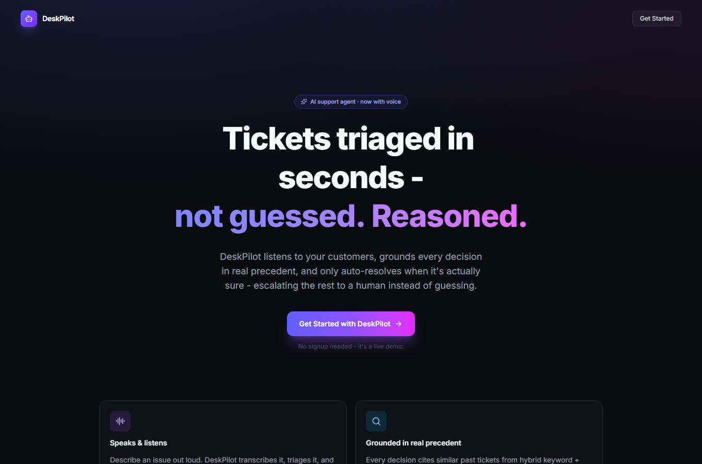
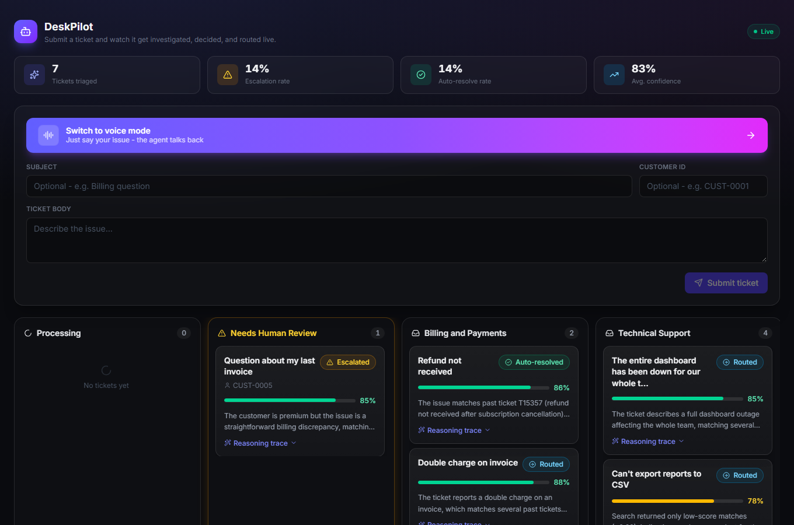
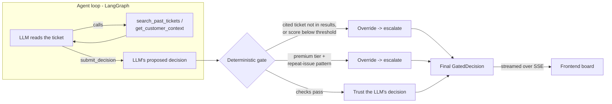
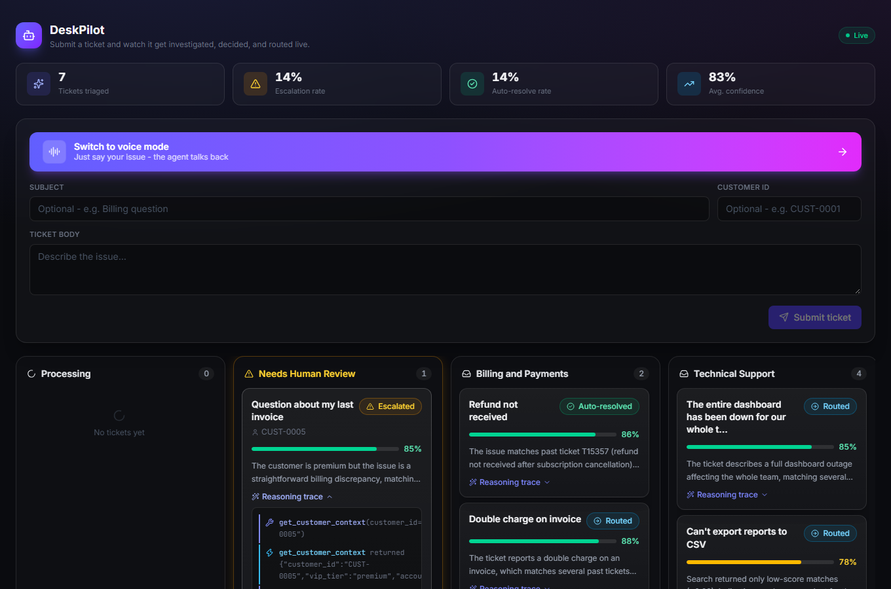

<div align="center">

# DeskPilot

**An agentic AI support-ticket triage system** — tool-calling, hybrid retrieval, a deterministic
confidence gate, and voice mode, built as a demonstration of applied AI engineering.




</div>

## What this is

Support teams either pay for a rules engine that can't handle nuance, or hand tickets to an LLM
that classifies confidently and is sometimes confidently wrong. DeskPilot is an attempt at a third
option: an agent that **investigates before it decides** — searching real historical resolutions and
the customer's account instead of guessing from the ticket text alone — and that sits behind a
**deterministic check that doesn't just trust the model's own confidence score**. When the evidence
is thin, it says so and hands the ticket to a human, instead of guessing.

It runs on a real dataset (28,587 historical support tickets, 16 columns, from a
[public Kaggle dataset](https://www.kaggle.com/datasets/tobiasbueck/multilingual-customer-support-tickets)),
plus a synthetic layer of customer profiles and account notes to give the agent something to
reason about beyond the ticket text.

## Features

- **Tool-calling agent, not a text classifier.** Built on LangGraph. The model can't just answer in
  free text — its only way to finish is calling a `submit_decision` tool with a structured, validated
  schema, after optionally calling `search_past_tickets` and `get_customer_context`.
- **A confidence gate that doesn't trust the LLM's self-report.** The model's own stated confidence
  is one input, not the final word. A deterministic layer re-checks it: does the ticket it cited as
  precedent actually exist in the retrieved results? Is the retrieval score above an empirically
  calibrated floor? Is this a premium customer with a repeat-issue pattern the model may be
  under-weighting? Any of those can override the model's own decision to `escalate` — with the
  override reason surfaced, not hidden.
- **Hybrid retrieval.** BM25 (keyword) and a MiniLM vector index (semantic), merged with Reciprocal
  Rank Fusion — because keyword-only misses paraphrases and vector-only misses exact terminology.
- **Swappable LLM provider.** Groq (`openai/gpt-oss-120b`) by default, Gemini as a one-line fallback,
  behind a thin provider abstraction — not hardcoded to one vendor.
- **Voice mode.** Speak a ticket instead of typing it. Speech-to-text, the same agent pipeline
  every typed ticket goes through, then a spoken readout of the routing decision — templated from the
  agent's own structured output, so it costs no extra LLM call.
- **Live reasoning, not a spinner.** Every tool call, tool result, and the final decision stream to
  the UI over SSE as they happen, with plain-language status text instead of raw function names.
- **Resilient by design.** The Redis cache, Postgres persistence, and Langfuse tracing are all
  fail-open — if any one of them is unreachable, the agent keeps working and only that optimization
  is lost. None of them can take the product down.



## How a ticket gets decided



The gate's overrides are visible in the UI, not just logged — expand a card's reasoning trace and
you'll see exactly when the model's own judgment call was overruled, and why.



## Design decisions worth knowing about

**Why a deterministic gate instead of trusting the model's confidence score?**
Because an LLM's self-reported confidence and its actual correctness aren't reliably correlated.
The gate was validated with four constructed cases bypassing the LLM entirely — a hallucinated
citation, a weak-evidence auto-resolve, a VIP+repeat pattern, and a legitimate pass-through — proving
the override logic works independent of what any particular model call happens to say.

**Why hybrid retrieval instead of just vector search?**
Measured, not assumed: BM25 alone hits 84.5% top-1 queue accuracy on this corpus, vector alone 83.5%,
and hybrid matches BM25 on top-1 while improving precision@5. Pure semantic search sounds more
sophisticated; it isn't automatically better here.

**Why a single agent instead of a multi-agent pipeline?**
The task - read a ticket, gather evidence, decide - doesn't have separable sub-roles that benefit
from separate agents. A multi-agent architecture here would add coordination complexity without a
task that actually needs it.

**A regression that got caught, not shipped.** Mid-project, giving the agent pre-tallied "queue vote"
statistics from retrieval results (i.e., "3 of 5 matches say Billing") looked like an obvious
improvement. Measured against the same eval slice, it dropped queue accuracy from 53% to 27% -
the agent over-trusted weak pluralities and started auto-resolving incorrectly. It was fully reverted.
The lesson kept: **measure every change against the eval harness before trusting it**, including the
ones that sound obviously correct.

## Voice mode

Speech-to-text and text-to-speech run through [Sarvam AI](https://www.sarvam.ai/)'s REST API
(English). It's a cascaded design - speech to text, then the *exact same* `/tickets` pipeline every
typed ticket uses, then text to speech - not a separate code path pretending to be one. The spoken
reply is built from the agent's own structured decision with a text template, so voice mode adds
zero extra LLM calls.

```
mic -> POST /voice/transcribe -> Sarvam STT -> POST /tickets (same path as typed tickets)
     -> agent decides -> GET /tickets/{id}/voice -> Sarvam TTS -> spoken back to the user
```

## Eval results, reported honestly

Retrieval accuracy (BM25/vector/hybrid, k=5, 103-ticket held-out slice) sits around 84% top-1 queue
accuracy. The full agent's queue accuracy on the same slice runs closer to **~50%** - a real,
measured gap between "the evidence available" and "what the agent does with it," not a number I'm
hiding. Two things explain part of it, found by building an actual confusion matrix rather than
guessing:

- **Some of the gap is label noise in the source data, not agent error.** Several "wrong" predictions
  were cases where the agent's own justification cited *other real historical tickets with near-identical
  requests that were themselves labeled differently* - the agent was being consistent with the corpus;
  the corpus was inconsistent with itself.
- **Some of it is a real, fixable bias**: the agent over-predicts the `Product Support` queue when
  evidence is weak, because it's large enough (~19% of the corpus) to plausibly surface in almost any
  vague retrieval result, while genuinely rare categories rarely get surfaced as precedent regardless
  of fit. An attempted fix (steering the agent toward `General Inquiry` as an explicit fallback) was
  tried, measured, and found not to move the number - `General Inquiry` is the rarest queue in the
  corpus (1.4%), so retrieval almost never gives the agent a reason to reach for it. Reverted, and
  left as an open problem rather than papered over.
- **Type accuracy holds up much better (~83-89%)** - the 4-category type taxonomy has far less
  ambiguity than the 10-category queue taxonomy, which is itself informative about where the
  difficulty actually lives.
- **All 3 hand-built flagship scenarios pass** (a VIP-repeat case that must escalate, a strong-match
  case that must auto-resolve, and a deliberately ambiguous case) - though the ambiguous one is a
  genuine coin-flip by design, and has flipped between `route` and `escalate` across runs, which is
  expected for a case built to sit near the decision boundary, not a bug.

Full eval methodology, raw run outputs, and the retrieval comparison numbers are in `eval/`.

## Tech stack

| Layer | Choice |
|---|---|
| Agent orchestration | LangGraph (tool-calling loop, not a fixed pipeline) |
| LLM | Groq (`openai/gpt-oss-120b`), Gemini as a swappable fallback |
| Retrieval | `rank_bm25` + Chroma (MiniLM embeddings), fused with Reciprocal Rank Fusion |
| Backend | FastAPI, async, SSE streaming, background-thread execution for the (synchronous) LLM calls |
| Persistence | Postgres (ticket history), Redis (decision cache) - both fail-open |
| Observability | Langfuse tracing |
| Voice | Sarvam AI (speech-to-text + text-to-speech) |
| Frontend | React 19, TypeScript, Tailwind CSS v4, Framer Motion, React Router |

## Project structure

```
app/
  agent/       LangGraph graph, prompts, tools, the confidence gate
  api/         FastAPI routes (tickets, voice)
  infra/       Redis cache, Postgres persistence, Langfuse tracing, Sarvam client - all fail-open
  llm/         Swappable Groq/Gemini provider
  models/      Pydantic schemas (the agent's decision contract; the HTTP contract)
  tools/       Retrieval (BM25 + vector), index build script, corpus loading
data/          Raw dataset loader, synthetic customer-profile generation
eval/          Eval harness, held-out slice builder, retrieval comparison, results
frontend/      React app - landing page, live ticket board, voice mode
scripts/       Deploy-time helpers (not needed for local dev)
```

## Running it locally

```bash
# Backend
python -m venv .venv && .venv/Scripts/activate   # or source .venv/bin/activate
pip install -r requirements.txt
cp .env.example .env          # fill in GROQ_API_KEY at minimum
python data/download_raw.py   # pulls the Kaggle dataset
python data/generate_customer_profiles.py
python -m app.tools.build_index
docker compose up -d          # local Postgres for ticket history (optional - fails open without it)
uvicorn app.main:app --reload

# Frontend
cd frontend
npm install
npm run dev
```

Voice mode needs a `SARVAM_API_KEY` in `.env`; without one, `/voice/*` endpoints return a clear 503
rather than failing silently.

## Known limitations / what's next

- **Deployment is currently paused, deliberately, not abandoned.** The backend's retrieval stack
  (torch + chromadb + sentence-transformers) needs more memory than Render's free tier (512MB) has -
  confirmed by an actual failed deploy, not assumed. A CPU-only torch build cut the Docker image from
  10.4GB to 2.85GB along the way (PyPI's default `torch` wheel bundles a full unused CUDA stack), but
  real measured peak usage still runs ~700MB. Railway's Hobby tier ($5/mo, 48GB ceiling) is the
  evaluated path forward when this resumes.
- **The queue-accuracy gap above is open, not solved.** The confusion-matrix analysis narrows down
  *where* the difficulty is; a real fix hasn't been found and measured yet.
- **No long-term customer memory across sessions yet.** `get_customer_context` is a static profile
  lookup, not a memory layer that evolves from real interactions (à la Mem0/Zep). Scoped as a
  follow-on phase - it needs its own multi-session synthetic scenarios to evaluate properly, not just
  a library integration.
- **No authentication on the API.** Fine for a local demo, not for anything real.
